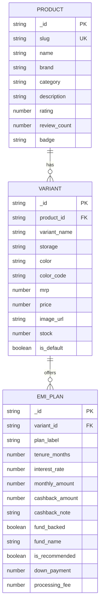

# 🛍️ 1Fi Marketplace - Shop Page & Mutual Fund-Backed EMI Catalog

> 🌐 **Live Demo**: [1Fi Marketplace | Smart EMIs Backed by Mutual Funds](https://1fi-coral.vercel.app/)  
> **Assignment Submission for 1Fi SDE Intern Role**  
> A faithful extension of the [1Fi Android App](https://play.google.com/store/apps/details?id=in.onefi.app&hl=en_IN) featuring a 3-tab **Shop** page and a full-stack **1Fi Marketplace** where electronics can be purchased on **0% No-Cost EMI** with **cashback invested directly into Mutual Funds** on the user's behalf.

---

## 🌐 Live Production Application

- **Live URL**: [1Fi Marketplace | Smart EMIs Backed by Mutual Funds](https://1fi-coral.vercel.app/)
- **API Endpoint**: [https://1fi-coral.vercel.app/api/products](https://1fi-coral.vercel.app/api/products)
- **Repository**: [https://github.com/Logamithrancb/1fi](https://github.com/Logamithrancb/1fi)

## 📸 Overview & Key Features

* **Faithful 1Fi Mobile Design Language**: Authentic 1Fi emerald palette (`#00D09C`), dark mode theme (`#080E1B` / `#0B1528`), custom typography, rounded pill containers, and mobile device frame toggle.
* **3-Tab Shop Navigation**:
  1. 🏢 **Top Brands**: Branded flagship store placeholders & onboarding tracker.
  2. 📍 **Nearby Stores**: Offline retail partner map & merchant locator placeholder.
  3. ✨ **1Fi Marketplace**: Live catalog with category/brand filters and mutual fund cashback highlights.
* **Dynamic Product Catalog & Deep Linking**:
  - Deep-linkable routes (e.g. `/products/apple-iphone-17-pro`, `/products/samsung-galaxy-s25-ultra`, `/products/google-pixel-9-pro`, `/products/oneplus-13-5g`).
  - Interactive variant selector (Storage & Color swatches) with live price recalculation.
* **Mutual Fund-Backed EMI Matrix**:
  - 0% No Cost EMI and tenure-based plans (3, 6, 9, 12, 18, 24 months).
  - Highlighting **1Fi Recommended** plans.
  - Transparent breakdown of mutual fund portfolio credits (e.g., *₹5,000 invested in Parag Parikh Flexi Cap Fund / SBI Small Cap Fund / Mirae Asset Large Cap Fund*).
* **Interactive Checkout Application**:
  - Slide-up bottom sheet with financing summary, PAN verification simulation, instant approval, and celebratory confetti animations.

---

## 🛠️ Tech Stack

| Layer | Technology |
|---|---|
| **Frontend** | React 18, Vite, Tailwind CSS, Lucide Icons, Canvas-Confetti |
| **Backend** | Node.js, Express.js, Morgan, CORS |
| **Database** | MongoDB Atlas (Cloud) / Mongoose ORM |
| **Architecture** | REST API, Monorepo (`frontend/` + `backend/`) |

---

## 🗄️ Database Schema & Data Models

The database structure maps products to variants and dynamic EMI plans with mutual fund metadata:



---

## 📡 REST API Documentation

### 1. List All Products
- **Endpoint**: `GET /api/products`
- **Query Params**: `?brand=Apple&category=Smartphones&search=iphone`
- **Response**:
```json
{
  "success": true,
  "count": 4,
  "data": [
    {
      "_id": "66d89f...",
      "slug": "apple-iphone-17-pro",
      "name": "Apple iPhone 17 Pro",
      "brand": "Apple",
      "category": "Smartphones",
      "rating": 4.9,
      "review_count": 342,
      "total_variants": 3,
      "default_variant": {
        "storage": "256GB",
        "color": "Natural Titanium",
        "mrp": 134900,
        "price": 129900,
        "image_url": "https://..."
      },
      "min_monthly_emi": 6150,
      "max_mf_cashback": 5000,
      "available_colors": ["Natural Titanium", "Deep Blue"],
      "available_storages": ["256GB", "512GB"]
    }
  ]
}
```

### 2. Get Product Detail by Slug
- **Endpoint**: `GET /api/products/:slug`
- **Example**: `GET /api/products/apple-iphone-17-pro`
- **Response**:
```json
{
  "success": true,
  "data": {
    "slug": "apple-iphone-17-pro",
    "name": "Apple iPhone 17 Pro",
    "brand": "Apple",
    "description": "The pinnacle of smartphone innovation featuring the A19 Pro...",
    "features": ["A19 Pro Chip", "Super Retina XDR 120Hz", "Triple 48MP Camera"],
    "variants": [
      {
        "_id": "66d89f1...",
        "variant_name": "256GB - Natural Titanium",
        "storage": "256GB",
        "color": "Natural Titanium",
        "mrp": 134900,
        "price": 129900,
        "emi_plans": [
          {
            "_id": "66d89f2...",
            "plan_label": "6 Months 0% Smart Plan",
            "tenure_months": 6,
            "interest_rate": 0,
            "monthly_amount": 21650,
            "cashback_amount": 3500,
            "fund_name": "Parag Parikh Flexi Cap Fund",
            "is_recommended": true
          }
        ]
      }
    ]
  }
}
```

### 3. Get Variant EMI Plans
- **Endpoint**: `GET /api/variants/:id/emi-plans`
- **Response**:
```json
{
  "success": true,
  "variant_id": "66d89f1...",
  "variant_name": "256GB - Natural Titanium",
  "price": 129900,
  "mrp": 134900,
  "emi_plans": [ ... ]
}
```

### 4. Create EMI Checkout Order
- **Endpoint**: `POST /api/orders/checkout`
- **Payload**:
```json
{
  "productId": "66d89f...",
  "variantId": "66d89f1...",
  "emiPlanId": "66d89f2...",
  "userPhone": "9876543210",
  "userPan": "ABCDE1234F"
}
```
- **Response**:
```json
{
  "success": true,
  "message": "EMI Application and Mutual Fund cashback initialized successfully",
  "data": {
    "order_id": "1FI-89A7B2",
    "status": "APPROVED",
    "product_name": "Apple iPhone 17 Pro",
    "monthly_emi": 21650,
    "tenure_months": 6,
    "cashback_invested": 3500,
    "mutual_fund_target": "Parag Parikh Flexi Cap Fund",
    "first_emi_date": "2026-10-04"
  }
}
```

---

## ⚡ Local Setup & Run Guide

### 1. Prerequisites
- **Node.js** (v18+)
- **MongoDB Atlas** connection string (or local MongoDB daemon)

### 2. Install Dependencies
```bash
# Install backend dependencies
cd backend
npm install

# Install frontend dependencies
cd ../frontend
npm install
```

### 3. Configure Backend Environment
In `backend/.env`, configure your MongoDB Atlas URI:
```env
PORT=5000
MONGODB_URI=mongodb+srv://<username>:<password>@cluster0.example.mongodb.net/1fi_marketplace?retryWrites=true&w=majority
NODE_ENV=development
```

### 4. Seed the Database
Populate 4 flagship products, multiple variants, and mutual-fund-backed EMI plans:
```bash
cd backend
npm run seed
```

### 5. Start Servers
```bash
# Terminal 1: Start Backend API (Port 5000)
cd backend
npm start

# Terminal 2: Start Frontend (Port 3000)
cd frontend
npm run dev
```

Visit **`http://localhost:3000`** in your browser.

---

## 🎥 2-5 Minute Demo Video Recording Guide

When recording your video walkthrough for the evaluation team, follow this structured script:

1. **Introduction (0:00 - 0:30)**:
   - Introduce yourself and state the objective: adding the **1Fi Marketplace** and **Shop page** to the 1Fi ecosystem with mutual fund-backed EMI options.
   - Highlight the authentic 1Fi visual theme (emerald accents, dark mode, card elevations, and mobile frame toggle).
2. **Shop Page & 3-Tab Architecture (0:30 - 1:15)**:
   - Click through the top 3 tabs:
     - **Top Brands**: Show brand partner placeholders and "Notify Me" action.
     - **Nearby Stores**: Show offline partner merchant locator placeholder.
     - **1Fi Marketplace**: Show the active catalog, promotional hero banner ("Get ₹5,000 Invested in Mutual Funds"), and category/brand filters.
3. **Product Detail & Variant Switching (1:15 - 2:15)**:
   - Tap into a product (e.g. **Apple iPhone 17 Pro** at `/products/apple-iphone-17-pro`).
   - Switch storage variants (256GB vs 512GB) and color swatches. Point out how the price, MRP discount, and monthly EMI recalculate dynamically via backend APIs.
4. **Mutual Fund-Backed EMI Plans & Wealth Breakdown (2:15 - 3:15)**:
   - Scroll to the EMI plans list. Explain the difference between **0% No-Cost EMI** and tenures up to 24 months.
   - Point out the **1Fi Recommended** badge and the **Mutual Fund Cashback** callout (`₹3,500 invested into Parag Parikh Flexi Cap Fund`).
   - Show the dedicated **1Fi Wealth Creation Benefit** card explaining AMFI direct folio credits.
5. **Checkout Flow & Conclusion (3:15 - 4:00)**:
   - Tap the sticky **"Proceed to Buy"** button.
   - Show the slide-up checkout summary modal with EMI schedule, simulated PAN/Phone verification, and instant approval confirmation with confetti.
   - Mention the clean backend architecture (Express REST APIs + MongoDB Atlas schema).
